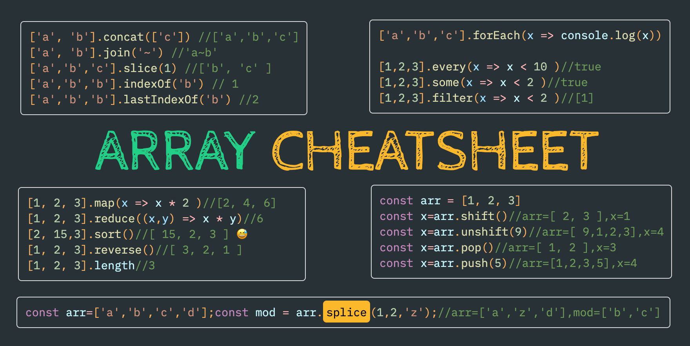
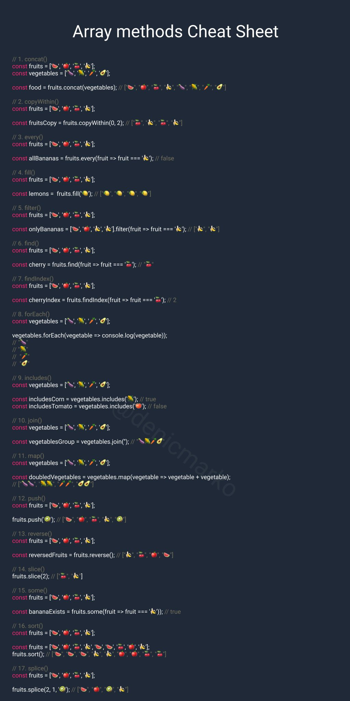

# JavaScript and JQuery

  Material simples com exemplos de JavaScript and JQuery. 
  Simple material with examples of JavaScript and JQuery.

### Tips and tricks

* [Repetir uma determinada <i>string</i> concatenada na string original.](https://github.com/JoseMateusCamargo/javascript/blob/main/javascript-tip/using.string.repeat.js)
* [Estilizando o <b>console.log</b>.](https://github.com/JoseMateusCamargo/javascript/blob/main/javascript-tip/estilo.in.console.js)
* [<b>Stop word</b>, pequena função / grande trabalho.](https://github.com/JoseMateusCamargo/javascript/blob/main/javascript-tip/stopword.js)
* [Use <b>performance.now</b> to measure executation speed.](https://github.com/JoseMateusCamargo/javascript/blob/main/javascript-tip/performance.now.js)
* [Capitalize (toUpperCase) first letter.](https://github.com/JoseMateusCamargo/javascript/blob/main/javascript-tip/capitalize.first.letter.js)

---

* [15 Javascript codes you will always need. ](https://github.com/JoseMateusCamargo/javascript/blob/main/tips-and-tricks/15.code.md)
* [Working with search parameters.](https://github.com/JoseMateusCamargo/javascript/blob/main/tips-and-tricks/working.with.search.params.js)
* [Simple way to reverse string. ](https://github.com/JoseMateusCamargo/javascript/blob/main/tips-and-tricks/reverse.string.js)
* [Using the Reviver Function in JSON.parse](https://github.com/JoseMateusCamargo/javascript/blob/main/tips-and-tricks/json.parse_reviver.js)
* [Expressões regulares.](https://github.com/JoseMateusCamargo/javascript/blob/main/tips-and-tricks/regex_tips.js)
* [Trabalhando com datas.](https://github.com/JoseMateusCamargo/javascript/blob/main/tips-and-tricks/date.js)
* [Difference between using <i>for in</i> and <i>for of</i>.](https://github.com/JoseMateusCamargo/javascript/blob/main/tips-and-tricks/loops_for-in_and_for-of.js)
* [How to Use the Spread Operator (…)](https://github.com/JoseMateusCamargo/javascript/blob/main/tips-and-tricks/spread_operator.js)

### Stack Overflow

* [Como detectar <b>URL</b> in texto e retornar como <b>link</b>.](https://github.com/JoseMateusCamargo/javascript/blob/main/stackoverflow/detect.urls.in.text.js)
* [Get substring after or before string.](https://github.com/JoseMateusCamargo/javascript/blob/main/stackoverflow/get.string.at.substring.js)
* [Get element by XPATH.](https://github.com/JoseMateusCamargo/javascript/blob/main/stackoverflow/get.element.by.xpath.js)
* [<b>ClearInterval</b>, clearing <b>SetInterval</b>.](https://github.com/JoseMateusCamargo/javascript/blob/main/stackoverflow/clear.setInterval.js)
* [Convert value to local currency.](https://github.com/JoseMateusCamargo/javascript/blob/main/stackoverflow/convert.value.to.local.currency.js)
* [Convert second to hour.](https://github.com/JoseMateusCamargo/javascript/blob/main/stackoverflow/second.to.hour.js)
* [Using <b>localStorage</b> to define a variable.](https://github.com/JoseMateusCamargo/javascript/blob/main/stackoverflow/set.and.get.localStorage.js)

### Request Method

* [Send the authorization header using <b>Axios</b>.](https://github.com/JoseMateusCamargo/javascript/blob/main/request-method/send.header.using.axios.js)
* [XMLHttp Request - pure Javascript.](https://github.com/JoseMateusCamargo/javascript/blob/main/request-method/XMLHttp.request.js)
* [Send a token (headers) using <b>AJAX</b>.](https://github.com/JoseMateusCamargo/javascript/blob/main/request-method/send.token.using.ajax.js)

### How to use (manual)

> * [<b>Generators </b> Understanding JS Generators.](https://github.com/JoseMateusCamargo/javascript/blob/main/generators/gener.app.js)

* [Entendendo <b>clousures</b>.](https://github.com/JoseMateusCamargo/javascript/blob/main/how-to-use/clousures.js)
* [Destaque de sintaxe HTML <b>String.raw()</b>.](https://github.com/JoseMateusCamargo/javascript/blob/main/how-to-use/html.syntax.highlighting.js)
* [Format the output of JSON.stringify.](https://github.com/JoseMateusCamargo/javascript/blob/main/how-to-use/json.stringify_format.js)
* [Diferentes tipos de <b>console.log</b> (info - table - assert - time - trace and more...).](https://github.com/JoseMateusCamargo/javascript/blob/main/how-to-use/console.methods.js)
* [<b>padStar</b> Method pads the current string with another string.](https://github.com/JoseMateusCamargo/javascript/blob/main/how-to-use/padStart.js)

---

#### Entendo 'Object'

> Um objeto é uma coleção de propriedades, e uma propriedade é uma associação entre um nome (ou chave) e um valor.

* [<b>Object.freeze</b>, let's go freezing an object.](https://github.com/JoseMateusCamargo/javascript/blob/master/object/Object.freeze.js)
* [Sealing an object with <b>Object.seal</b>.](https://github.com/JoseMateusCamargo/javascript/blob/master/object/Object.seal.js)
* [Using <b>Object literal</b> like a boss.](https://github.com/JoseMateusCamargo/javascript/blob/master/object/obj.literal.js)
* [<b>Object.values</b>, get values of JSON, using <b>forEach</b>.](https://github.com/JoseMateusCamargo/javascript/blob/master/object/Object.values.js)

### Interview Question

* [Some interview questions.](https://github.com/JoseMateusCamargo/javascript/blob/master/interview-question/README.md)

### Snippets

* [Carousel Logic.](https://github.com/JoseMateusCamargo/javascript/blob/main/snippets/carousel_logic.js)
* [Capture Barcode-Qrcode reader (keyboard-wedge) events.](https://github.com/JoseMateusCamargo/javascript/blob/main/snippets/wedge_barcode_capture_event.js)
* [Counting occurrences in a string.](https://github.com/JoseMateusCamargo/javascript/blob/main/snippets/count_occurrences.js)
* [Recursive Function in ATM machine example.](https://github.com/JoseMateusCamargo/javascript/blob/main/snippets/recursive_ATM_machine.js)
* [Methods to parse <b>table to JSON</b>.](https://github.com/JoseMateusCamargo/javascript/blob/main/snippets/table_to_JSON.js)
* [Change class CSS using JQuery.](https://github.com/JoseMateusCamargo/javascript/blob/main/snippets/change_class_css.js)
* [<b>onKeyPressed</b> Execute a JavaScript when a user presses a key.](https://github.com/JoseMateusCamargo/javascript/blob/main/snippets/onkeypress_event.js)
* [Creating a simple clock.](https://github.com/JoseMateusCamargo/javascript/blob/main/snippets/simple_javascript_clock.js)

---

### Array Cheatsheet 🚀

* [Manipulating Arrays in JavaScript](https://github.com/JoseMateusCamargo/javascript/tree/master/arrays-manipulating#readme)

### Direitos de uso (Use rights)

  Você tem todo o direito de usar esse material para seu próprio aprendizado. 
  You can use this material for your own learning.

