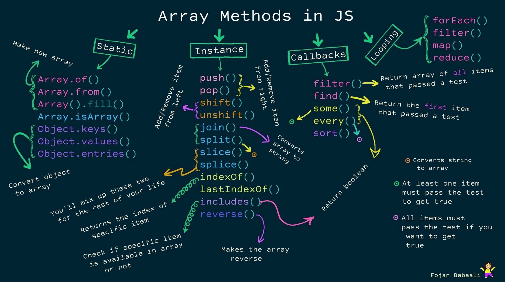

# JavaScript and JQuery

  Material simples com exemplos de JavaScript and JQuery. 
  Simple material with examples of JavaScript and JQuery.

### Manipulating Arrays in JavaScript

* [Usando <b>array.at</b> para retornar o item referente a sua index.](https://github.com/JoseMateusCamargo/javascript/blob/main/arrays-manipulating/array.at.js)
* [Find max id in array using <b>(array.forEach, map, reduce & Math.max)</b>.](https://github.com/JoseMateusCamargo/javascript/blob/master/arrays-manipulating/max.id.js)
* [Use <b>array.every</b> to check if all elements pass the test.](https://github.com/JoseMateusCamargo/javascript/blob/master/arrays-manipulating/array.every.js)
* [Remove <b>False</b> value in <b>array</b>.](https://github.com/JoseMateusCamargo/javascript/blob/master/arrays-manipulating/remove.false.value.js)

---

> [Static methods.](https://github.com/JoseMateusCamargo/javascript/blob/master/arrays-manipulating/static.methods.js)  
> Esses métodos são usados para criar novas matrizes ou converter objetos iteráveis
> e semelhantes a matrizes em matrizes.

> [Mutation methods.](https://github.com/JoseMateusCamargo/javascript/blob/master/arrays-manipulating/mutation.methods.js)  
> Os métodos a seguir são métodos de instância ou métodos prototípicos.
> Eles são chamados em uma instância de array específica para aplicar mutações.

> [Other instance methods.](https://github.com/JoseMateusCamargo/javascript/blob/master/arrays-manipulating/others.methods.js)  
> Esses são outros métodos de instância pura que não alteram o array.

> [Traditional loops.](https://github.com/JoseMateusCamargo/javascript/blob/master/arrays-manipulating/traditional.loops.js)  
> Usando um loop tradicional com todas as suas variantes (ou seja, for, for-of e .forEach () loops).

> [Replacing traditional loops.](https://github.com/JoseMateusCamargo/javascript/blob/master/arrays-manipulating/replacing.traditional.loops.js)  
> Usando (.map(), .filter(), .find() & .findIndex(), .reduce(), .every() & .some() e .sort()).

[Using ES6 features.](https://github.com/JoseMateusCamargo/javascript/blob/master/arrays-manipulating/ES6.features.js)

#### Array methods 🚀

### Direitos de uso (Use rights)

  Você tem todo o direito de usar esse material para seu próprio aprendizado. 
  You can use this material for your own learning.

